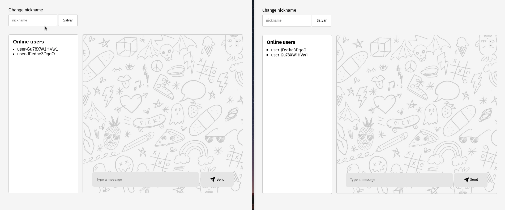

<h1 align="center">Web chat</h1>
<p align="center">
  
  <a href="https://twitter.com/defauth8" target="_blank">
  </a>
</p>

<p align="center">
  
</p>

### :computer: Projeto

Chat em tempo real usando Socket.io e arquitetura MVC.

### :nut_and_bolt: Tecnologias

Esse projeto foi desenvolvido com as seguintes tecnologias:

- [NodeJS][nodejs]
- [Express][express]
- [Socket.io][socket-io]
- [ejs][ejs]

[nodejs]: https://nodejs.org/en/
[express]: https://expressjs.com/pt-br/
[socket-io]: https://socket.io/
[ejs]: https://ejs.co/

### :thinking: Como rodar

```bash
# Clone o repositório
git clone https://github.com/defauth98/web-chat.git web-chat

# Entre no diretório
cd web-chat

# Instale as depedências
npm install

# Rode o projeto
npm start
```

---

### :bust_in_silhouette: Autor

<table>
  <tr>
    <td align="center">
      <a href="https://github.com/defauth98">
        
        <br />
          <sub>
            <b>Daniel Ribeiro</b>
          </sub>
      </a>
    </td>
  </tr>
</table>
